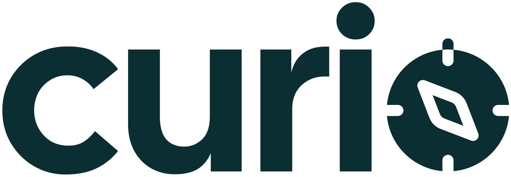
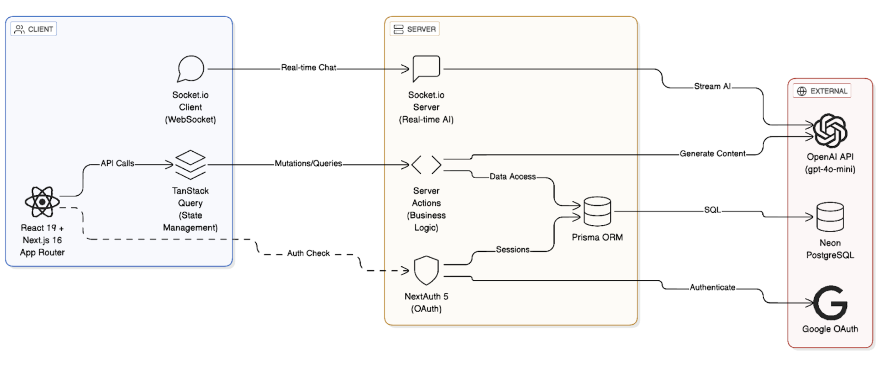

Create courses on anything tailored to your unique background and interests — powered by AI.

## Setup Instructions

1. Clone the repository
2. Install dependencies: `npm install`
3. Set up environment variables in `.env`:
   ```
   DATABASE_URL="postgresql://..."
   OPENAI_API_KEY="sk-..."
   AUTH_SECRET="..."
   NEXTAUTH_URL="http://localhost:3000"
   ```
4. Set up the database: `npx prisma migrate dev`
5. Start the development server: `npm run dev`

## Tech Stack
**Frontend**: React 19.0.0, TypeScript 5, Tailwind 3.4.18, shadcn/ui, React Hook Form 7.65.0, TanStack Query 5.90.8

**Backend**: Next.js 16.0.4, Prisma 6.19.0 (ORM), PostgreSQL (DB), Socket.io 4.8.1 (WebSockets)

**Cloud/APIs**: Vercel (app hosting), Neon (DB hosting), NextAuth 5.0.0-beta.29 (auth), OpenAI 6.1.0 (LLM)

**Testing**: Vitest 4.0.1, Testing Library 16.3.0, jsdom 27.0.1

## Architecture



This full-stack application follows a simple architectural pattern, split into three layers (backend to frontend):

- Server actions (/src/lib/actions): business logic that manipulates data
- Custom hooks: React Query abstractions that utilize the actions
- Components: inject custom hooks into React components